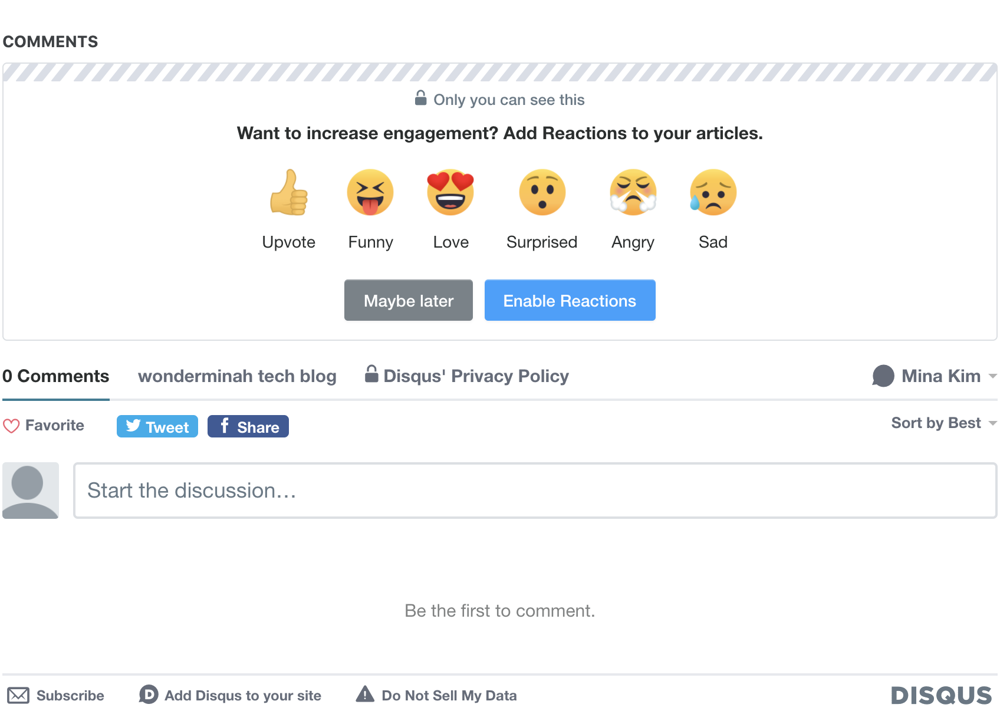

# 이용 가능한 프로바이더

[_config.yaml](https://github.com/mmistakes/minimal-mistakes/blob/master/_config.yml#L32-L55)

* provider
* disqus
* discourse
* facebook
* utterances
* giscus
* staticman

이 중 disqus와 utterances가 가장 많이 쓰이는 것 같다.
disqus가 최근에 광고를 추가한 탓에 utterances로 바꾼다는 블로거 분들이 많이 보였는데, utterances는 깃허브 로그인을 통한 댓글 작성만 지원하는 것으로 보였다. 나는 깃허브 이외에도 다양한 소셜 로그인을 통한 댓글 작성이 가능하도록 하고 싶었기에, disqus를 사용하기로 했다.

# disqus 가입

[disqus.com](https://disqus.com/)

* 플랜은 Basic Plan 선택
* 플랫폼은 jekyll 선택
* Comment 세팅은 Balanced로 선택   
  (Strict의 경우 이미지, 비디오, 링크를 코멘트에 포함시킬 수 없다고 하여 나는 우선 포함 가능하도록 열어두기로 했다.)

# Universal Code 설정

_layout/posts.html의 가장 하단에 아래 코드를 추가.   
코드는 사용자마다 다르므로 각자의 disqus 관리자 페이지에서 확인 필요.

```html
<div id="disqus_thread"></div>
<script>
    /**
     *  RECOMMENDED CONFIGURATION VARIABLES: EDIT AND UNCOMMENT THE SECTION BELOW TO INSERT DYNAMIC VALUES FROM YOUR PLATFORM OR CMS.
     *  LEARN WHY DEFINING THESE VARIABLES IS IMPORTANT: https://disqus.com/admin/universalcode/#configuration-variables
     */

    var disqus_config = function () {
      this.page.url = 'https://wonderminah.github.io{{ page.url }}';  // Replace PAGE_URL with your page's canonical URL variable
      this.page.identifier = '{{ page.id }}'; // Replace PAGE_IDENTIFIER with your page's unique identifier variable
    };

    (function() { // DON'T EDIT BELOW THIS LINE
      var d = document, s = d.createElement('script');
      s.src = 'https://wonderminah-tech-blog.disqus.com/embed.js';
      s.setAttribute('data-timestamp', +new Date());
      (d.head || d.body).appendChild(s);
    })();
</script>
<noscript>Please enable JavaScript to view the <a href="https://disqus.com/?ref_noscript">comments powered by Disqus.</a></noscript>
```

# 결과



끝~  
Be the first to comment! 이렇게 성의없이 포스팅하는 블로그에도 누군가 관심을 가져줄까요.