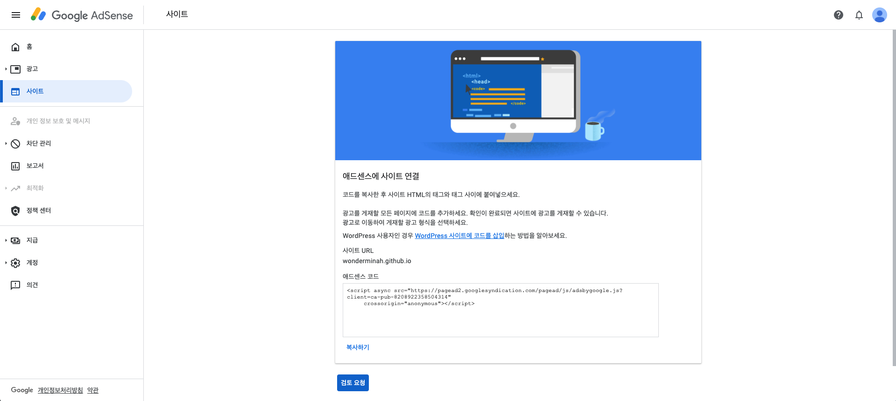

# 고객 정보 입력

간단하다. 이름과 주소를 입력하면 끝. 수취 가능한 주소여야 한다고 하여 나의 경우 일본 거주지 주소를 입력하였다.

# 애드센스에 사이트 연결



레이아웃에 그대로 추가하게 되면 나중에 관리가 안 될것 같아 이전의 Google Analytics처럼,   
별도의 html 파일을 만들고 호출하는 방식을 사용하기로 하였다.

```bash
wonderminah.github.io
├── _includes
|  └── advertisement-provider
|     └── google-adsense.html (이 파일에 해당 코드를 추가)
└── default.html (이 파일에서 google-adsense.html을 include)
```

```html
<!-- _includes/advertisement-providers/google-adsense.html -->
<script async src="//pagead2.googlesyndication.com/pagead/js/adsbygoogle.js"></script>
<script>(adsbygoogle = window.adsbygoogle || []).push({});</script>
```

```html
<!-- default.html -->
<!-- include가 실행되어 블로그 화면에 google-adsense.html 내용이 표시되는 바람에 일부러 주석처리 하였습니다 -->
    <!---->
  </body>
</html>
```

[minimal-mistakes](https://github.com/mmistakes/minimal-mistakes/blob/master/docs/_layouts/default.html#L53-L54)에서도 default.html 레이아웃에서 호출하고 있었기에 이를 참고로 하였다.

# 광고 설정 확인

어떤 형태의 광고를 게재할 것인지를 설정한다.   
설정에 변경이 있을 경우 반영에 1시간 가량이 소요된다고 한다.

# 사이트 검증

태그 구현과 광고 설정을 마쳤으면 사이트 검증을 신청한다.    
그러나 나의 경우 도착한 메일을 확인하니 다음과 같은 내용이...

> **애드센스 신청 결과 알림**
>
> 애드센스에 관심을 가져 주셔서 감사합니다. 애드센스 전문가가 신청서를 검토한 결과 프로그램 기준을 충족하지 못한 부분이 있어 애드센스 이용 신청이 거부되었음을 알려 드립니다. 애드센스 프로그램 정책은 게시자와 광고주 모두가 Google 광고로 효과를 거둘 수 있도록 하기 위해 마련되었습니다. Google에서는 모든 게시자에 대해 검토 작업을 진행하며, 검토 결과에 따라 애드센스 신청을 거부할 수 있습니다. 변경을 통해 애드센스 프로그램 기준을 충족하면 향후 애드센스 이용을 다시 신청할 수 있습니다. 거부 결정에 대한 구체적인 이유를 문의하실 경우 답변해 드리지 못할 수 있음을 알려 드립니다. 양해해 주셔서 감사합니다. 감사합니다. Google 애드센스 팀

포스팅을 더 열심히 해야하나.
