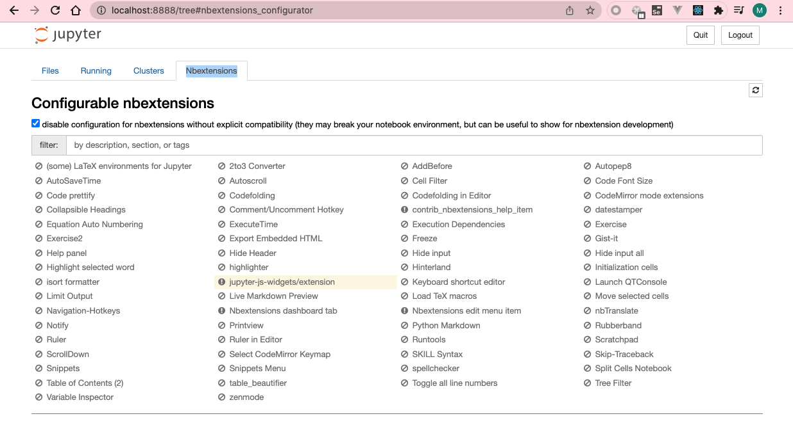

# Precondition

전제: 파이썬이 설치되어 있어야 한다.   
나의 경우 파이썬 3이 이미 설치되어 있는 것을 확인 했으므로 다음 단계로 넘어간다.

```bash
$ python3 --version
Python 3.10.1
```

# Jupyter notebook

pip 커맨드로 jupyter가 설치되어 있는지 확인한다.

```bash
$ pip3 list | grep jupyter
```

없는 경우 설치를 진행한다.

```bash
$ pip3 install jupyter
```

설치를 완료하고 다시 grep jupyter 커맨드를 실행하면, 아래와 같이 설치가 완료된 것을 확인할 수 있다.

```bash
$ pip3 list | grep jupyter
jupyter              1.0.0
jupyter-client       7.1.2
jupyter-console      6.4.3
jupyter-core         4.9.2
jupyterlab-pygments  0.1.2
jupyterlab-widgets   1.0.2
```

jupyter의 환경변수 또한 존재하는 것을 확인할 수 있다.

```bash
$ which jupyter
/Library/Frameworks/Python.framework/Versions/3.10/bin/jupyter
```

아래 커맨드를 실행하면, 아래와 같이 8888번 포트에서 실행이 되면서 자동으로 브라우저에 notebook 화면이 표시될 것이다.

```bash
$ python -m notebook
...
[I 23:58:05.948 NotebookApp] http://localhost:8888/?token=XXX
...
```


# Nbextensions

jupyter notebook에서 table of contents를 사용할 수 있게 해주는 익스텐션이다.   
pip로 설치할 경우 아래와 같은 커맨드로 설치할 수 있다.

```bash
$ pip3 install jupyter_contrib_nbextensions  # 라이브러리 설치
$ jupyter contrib nbextension install --user # jupyter notebook에서 사용할 수 있도록 등록
$ python -m notebook                         # jupyter notebook을 재시작
```

아래와 같이, Nbextensions 탭이 새롭게 표시된다면 문제없이 설치된 것이다.

