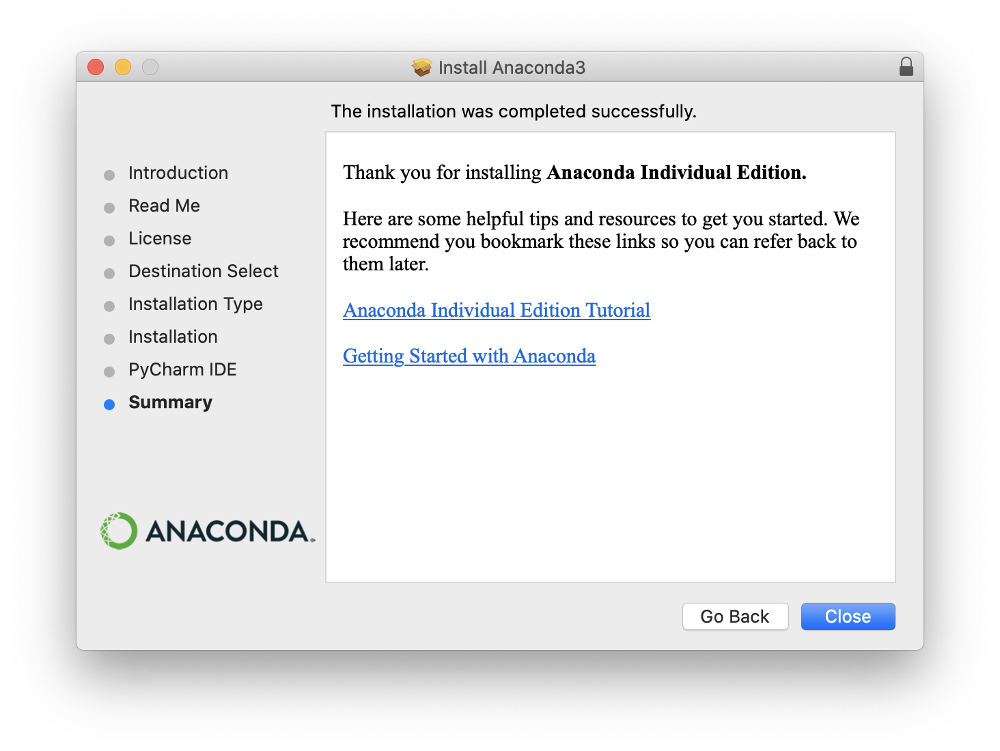

# About Anaconda

pip가 PC의 모든 환경에 공통된 패키지를 설치한다면,    
Anaconda는 가상환경을 만들고 각각의 가상환경 별로 패키지를 관리할 수 있도록 해준다.    

다수의 프로젝트가 존재하면서, 각 프로젝트별 패키지의 버전 의존성을 별개로 관리할 수 있다는 장점이 있다.   
나의 경우 아직 다수의 프로젝트를 만들 상황은 아니지만, 우선은 설치만 해두기로 한다.

# Installation

[Anaconda 공식 홈페이지](https://www.anaconda.com/products/individual)에서 OS에 맞게 다운로드를 진행한다. 나의 경우 MacOS.   
아래와 같이 설치가 완료되었다.

