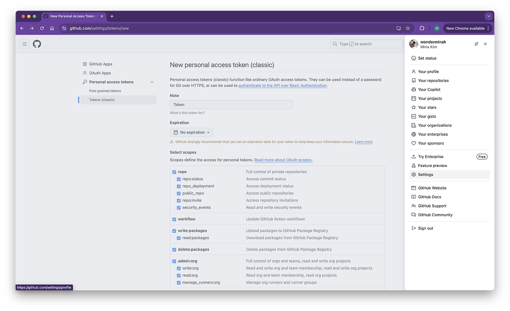
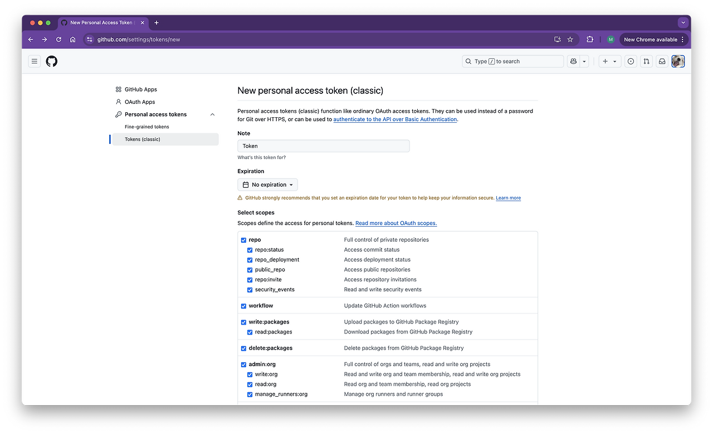
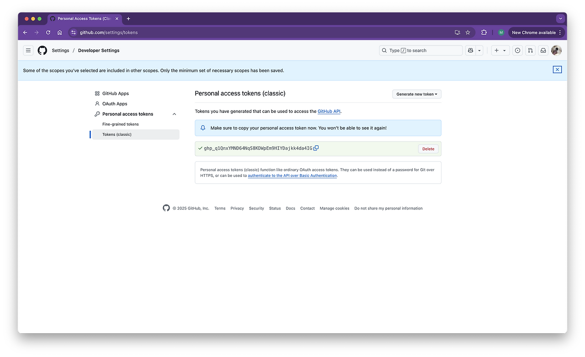

# 문제

Commit 및 Push 시 아래와 같은 에러가 발생. Password 를 통한 인증은 2021년 8월 13일부로 삭제되었다고 한다.

```
remote: Support for password authentication was removed on August 13, 2021.
remote: Please see https://docs.github.com/get-started/getting-started-with-git/about-remote-repositories#cloning-with-https-urls for information on currently recommended modes of authentication.
```

# 해결방법

결론부터 이야기하면 토큰 추가가 필요하다. 화면 오른쪽의 Settings 로 들어간다.



여러 방법이 있을 수 있으나, 가장 간단한 방법을 소개한다. Personal access tokens → Tokens (classic)을 선택한다.



이용을 허용할 Scope 를 선택하고 [Generate Token] 버튼을 눌러 토큰을 생성한다.



위와 같이 토큰이 생성되었다. 중요한 것은 위 화면은 한 번만 표시한다고 하니, 반드시 어딘가 다른 곳에 킵해두어야 한다.