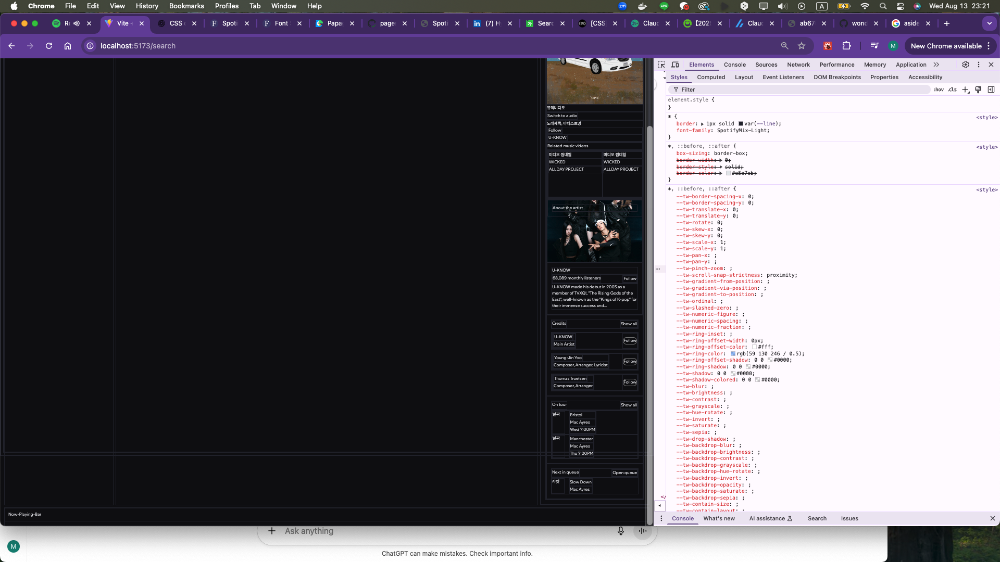

Spotify 사이트를 열심히 훔쳐봐가며 잡아본 사이드바 레이아웃. 아직 갈 길이 한참이지만... 



오늘 배운 내용을 메모한다.

## HTML

```html
<aside>
```

**HTML5 시맨틱 태그** 중 하나로, 본문 내용과 직접적인 관련성은 낮지만 **보조 정보**나 **부가 콘텐츠**를 담을 때 사용한다.

### **주요 용도**

- **사이드바** (좌/우 측면에 배치)
- **관련 링크** 모음
- **광고** 또는 **프로모션 영역**
- **작가 소개**, **참고 문헌**
- **관련 글 목록**

핵심은 **메인 콘텐츠를 이해하는 데 필수는 아니지만, 관련성 있는 보조 정보**를 넣는 곳이라는 점이다.

### **시각적 예**

- **블로그**: 본문 왼쪽/오른쪽에 인기글, 태그 목록, 광고
- **뉴스 사이트**: 기사 옆 관련 기사 목록
- **쇼핑몰**: 필터, 추천상품

### 요약

- **의미**: 보조 콘텐츠 영역
- **위치**: 주로 메인 옆 또는 페이지 하단
- **SEO**: 시맨틱 구조를 명확히 해주지만, 메인 검색 키워드의 중심이 되지 않음

## CSS

```css
align-items
align-self
align-content
```

CSS에서 `align-`으로 시작하는 속성들은 주로 **Flexbox**와 **Grid**에서 정렬을 제어하는 데 쓰인다.
하지만 각각 **작동하는 대상·축·상황**이 조금씩 다르다. 표로 정리하면 아래와 같다.

**Flexbox / Grid 공통**

| 속성                | 적용 대상            | 역할                                                         | 동작 축                                       |
| ------------------- | -------------------- | ------------------------------------------------------------ | --------------------------------------------- |
| **`align-items`**   | 모든 **자식 아이템** | 컨테이너 안에서 아이템들의 **교차축**(cross-axis) 위치를 한 번에 맞춤 | Flex: 주축이 `row`면 세로 / `column`이면 가로 |
| **`align-self`**    | **특정 자식 아이템** | 개별 아이템의 교차축 정렬                                    | 부모의 `align-items`보다 우선                 |
| **`align-content`** | **여러 줄(line)**    | 교차축 방향으로 **줄 그룹** 간 간격 조절 (줄이 2줄 이상일 때만 작동) | Flex wrap 사용 시나 Grid 다중 행              |