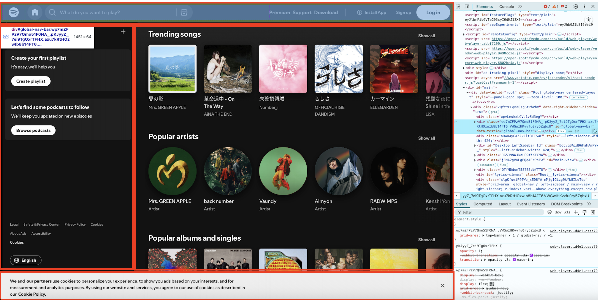
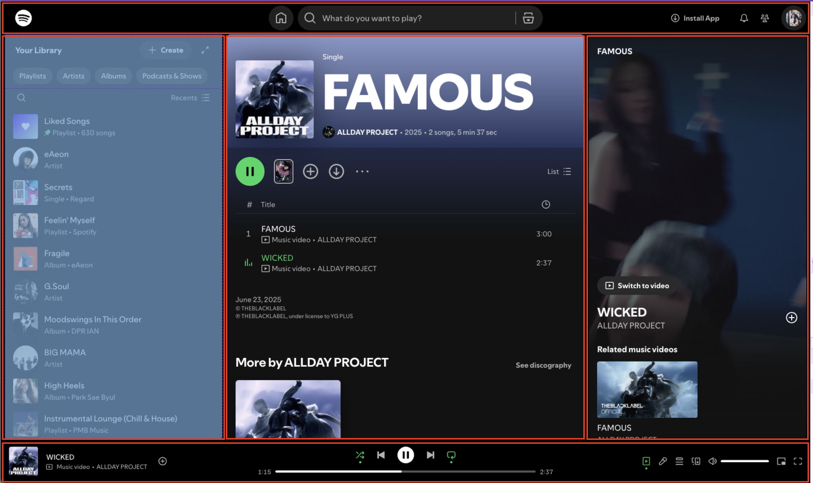
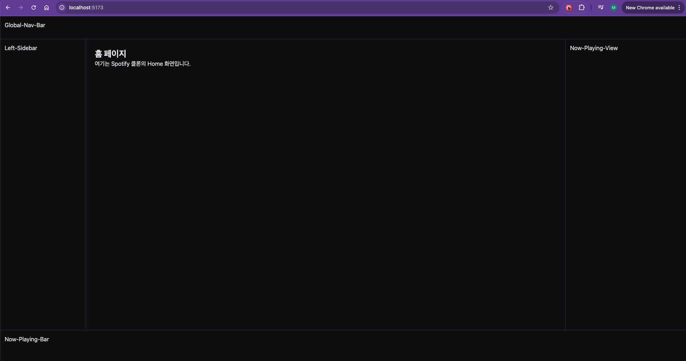
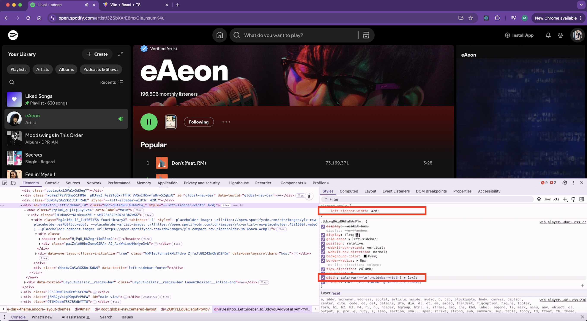
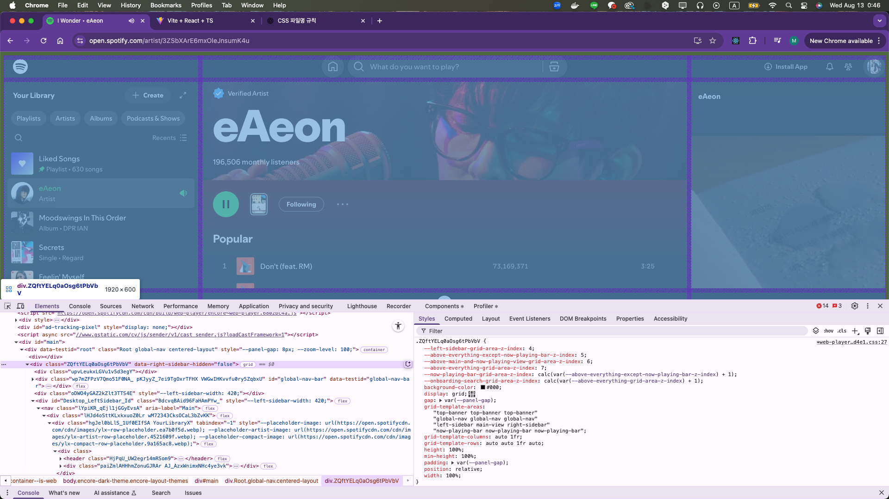

연습용으로 백엔드 없이 프론트엔드만 만들어보기로 하자.
Vite + React + TypeScript + TailwindCSS 스택으로 진행한다.

## 1. 프로젝트 생성

```bash
# Vite + React + TypeScript 템플릿 생성
➜  Projects npm create vite@latest spotify-clone-coding -- --template react-ts

# 패키지 설치
➜  Projects cd spotify-clone-coding
➜  spotify-clone-coding git:(main) ✗ npm install
```

## 2. TailwindCSS 설치

```bash
# tailwindcss 는 최신 3으로 설치했더니 init 에서 에러가 나서, 안정 버전 3으로 재설치 하였다.
➜  spotify-clone-coding git:(main) ✗ npm install -D tailwindcss@3 postcss autoprefixer

# init
➜  spotify-clone-coding git:(main) ✗ npx tailwindcss init -p

# init 하고나면 아래의 tailwind.config.js 파일이 생긴다.
➜  spotify-clone-coding git:(main) ✗ ll tailwind.config.js
-rw-r--r--  1 minah.kim  staff   126B Aug 12 21:42 tailwind.config.js
```

### Tailwind Config 에 스캔할 파일 추가

tailwind.config.js 파일에, 스캔할 파일 확장자를 넣어준다.

```js
export default {
  content: [
    "./index.html",
    "./src/**/*.{js,ts,jsx,tsx}",
  ],
  theme: {
    extend: {},
  },
  plugins: [],
}
```

index.html 과 src 밑의 ts, ts, jsx, tsx 경로를 넣음으로써, 거기에서 사용되는 TailwindCSS 클래스가 빌드 결과 CSS에 포함된다.

### CSS에 Tailwind 지시어 추가

`src/index.css` (또는 `src/main.css`) 에 아래 내용을 추가한다.

```css
@tailwind base;
@tailwind components;
@tailwind utilities;
```

Tailwind의 **초기화 스타일 + 기본 컴포넌트 스타일 + 유틸리티 클래스**를 불러오는 코드이다.

## 3. React Router 설치, 페이지 라우팅 설정

페이지 구조를 잡기 위해, 라우팅 라이브러리인 리액트 라우터를 설치한다.

```bash
npm install react-router-dom
```

react-router-dom 은 브라우저 환경에서 사용하는 React Router 패키지이다.

### 라우팅 구조 만들기

Spotify 사이트를 살펴보니 아래와 같은 URI 구조를 가지고 있었다. ※ 우선 로그인 이전 상태에서 볼 수 있는 URI 이다.

```
/playlist/:아이디
/album/:아이디
/artist/:아이디
/section/:아이디 → 특정 큐레이션 묶음, 장르/테마 페이지
/search/:검색어
```

우선 위 URI 구조에 따라 .tsx 를 작성한다.

```
src/
 ├── pages/
 │    ├── Album.tsx
 │    ├── Artist.tsx
 │    ├── Collection.tsx
 │    ├── Home.tsx
 │    ├── Playlist.tsx
 │    ├── Search.tsx
 │    └── Section.tsx
 ├── App.tsx
 ├── main.tsx
 └── index.css
```

## 4. 레이아웃 구조잡기

스포티파이 화면 레이아웃을 살펴보면 아래와 같다.

### 로그인 전

상단 네비게이션, 좌측 사이드바, 아래 알림(로그인 시 플레잉 바), 앨범 표시 부분으로 나뉜다.



### 로그인 후

상단 네비게이션, 좌측 사이드바, 아래 알림(로그인 시 플레잉 바), 앨범 표시 부분, 그리고 우측 사이드바가 로그인 시 더해지는 형태이다.



로그인 후까지 가정하여, 컴포넌트를 아래와 같이 구성하자. 네이밍은 스포티파이 Elements 를 살펴보고 따왔다.

* 상단 네비게이션: Global-Nav-Bar
* 좌측 사이드바: Left-Sidebar
* 아래 플레잉바: Now-Playing-Bar
* 메인 컨텐츠: Main-View
* 우측 재생화면: Now-Playing-View

```bash
+------------------------------------------------------+
| Global-Nav-Bar (상단)                                 |
+-----+----------------------------------+-------------+
|     |                                  |             |
|Left-|                                  | Now-        |
|Side-|                                  | Playing-    |
|bar  |            Main-View             | View        |
|(좌측)|                                  | (우측)       |
|     |                                  |             |
|     |                                  |             |
+-----+----------------------------------+-------------+
| Now-Playing-Bar (하단)                                |
+------------------------------------------------------+
```

### 레이아웃 파일

```tsx
import { Outlet } from "react-router-dom";
import GlobalNavBar from "./GlobalNavBar";
import LeftSidebar from "./LeftSidebar";
import NowPlayingBar from "./NowPlayingBar";
import NowPlayingView from "./NowPlayingView";
import "./layout.css";

export default function Layout() {
  return (
    <div className="app-shell">
      <header className="global-nav-bar">
        <GlobalNavBar />
      </header>

      <aside className="left-sidebar">
        <LeftSidebar />
      </aside>

      <main className="main-view">
        <Outlet />
      </main>

      <aside className="now-playing-view">
        <NowPlayingView />
      </aside>

      <footer className="now-playing-bar">
        <NowPlayingBar />
      </footer>
    </div>
  );
}
```

여기서 살펴볼 점은 `<Outlet />` 이다. 다른것은 내가 만든 컴포넌트인데, 이것은 React Router 의 기본 내장 기능이다.
Outlet 을 쓰는 이유는 Layout 안에서 페이지 내용을 교체하기 위해서이다.
Spotify 는 **Global-Nav-Bar, Left-Sidebar, Now-Playing-Bar, Now-Playing-View**는 항상 고정이며, 
**Main-View**만 URL에 따라 바뀐다.
→ 이 “Main-View” 자리에 `Outlet`이 들어가면 깔끔하다.


```tsx
			<Routes>
        {/* Layout을 부모로 지정 */}
        <Route element={<Layout />}>
          <Route path="/" element={<Home />} />
          <Route path="/album" element={<Album />} />
          <Route path="/artist" element={<Artist />} />
          <Route path="/collection" element={<Collection />} />
          <Route path="/" element={<Home />} />
          <Route path="/playlist" element={<Playlist />} />
          <Route path="/search" element={<Search />} />
          <Route path="/section" element={<Section />} />
        </Route>
      </Routes>
```

이제 App.tsx 에서 `<Route element={<Layout />}>` 를 넣어주자. 
그러면 Layout 은 항상 렌더되고, Main-View 만 path="" 의 URL 패스에 맞는 컴포넌트가 <Outlet /> 에 렌더링 되는 것이다.

### 5. CSS 틀 잡기

```css
/* 전체 레이아웃: CSS Grid */
  .app-shell {
    display: grid;
    grid-template-columns: 240px 1fr 340px; /* 좌측 / 메인 / 우측 */
    grid-template-rows: 64px 1fr 90px;      /* 상단 / 내용 / 하단 */
    grid-template-areas:
      "global-nav-bar global-nav-bar global-nav-bar"
      "left-sidebar main-view now-playing-view"
      "now-playing-bar now-playing-bar now-playing-bar";
    height: 100vh;
  }
```

* display: grid; 를 선언하면 그리드 형식을 사용하게 된다.
* grid-template-columns: 좌측 240px, 가운데 1fr (나머지 채움), 우측 340px 고정
* grid-template-rows: 상단 64px 고정, 가운데 1fr (나머지 채움), 하단 90px 고정
* grid-template-areas: 3*3 grid 가 있다고 했을 때, 
  * 맨 위 컬럼은 global-nav-bar 가 3칸을 다 차지
  * 가운데 컬럼은 left-sidebar, main-view, now-playing-view 한 칸씩
  * 맨 아래 컬럼은 now-playing-bar 가 3칸을 다 차지
* height: 100vh; 를 선언하면 전체 높이에 맞게 그리드가 화면에 꽉 찬다.

나온 화면은 아래와 같다.




그런데, Spotify 화면을 보면 왼쪽 사이드바와 오른쪽 사이드바가 화면 width에 따라 줄어들고 늘어나는 것이 보인다.

<video src="../../../assets/img/Screen Recording 2025-08-13 at 0.31.36.mov"></video>


코드를 보아하니, 420px 로 고정이면서 width 가 calc() 값에 따라 유동적으로 변하는 것 같다.




보다보니 Spotify 역시 grid로 나누어져 있는것을 알 수 있었다.




오늘은 여기까지.