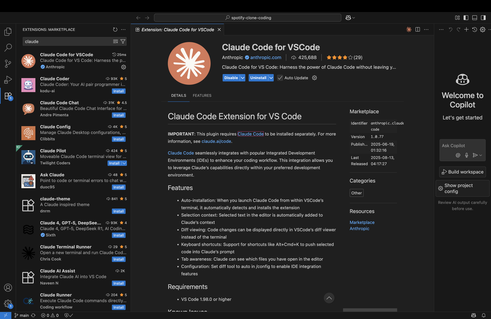
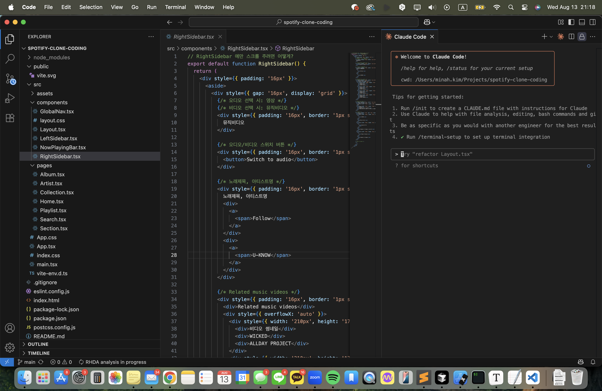

지금은 커서 AI 를 써서 개발을 해왔는데, 코딩 성능이 최상위권이라는 요즘 핫한 클로드 코드도 한 번 써보자.

# 패키지 설치

## claude-code 패키지 설치

```bash
➜  ~ npm install -g @anthropic-ai/claude-code
```

## 로그인

```
claude "/login"
```

## 컬러 모드 설정

```
╭──────────────────────────╮
│ ✻ Welcome to Claude Code │
╰──────────────────────────╯

 Let's get started.

 Choose the text style that looks best with your terminal:
 To change this later, run /theme

 ❯ 1. Dark mode✔
   2. Light mode
   3. Dark mode (colorblind-friendly)
   4. Light mode (colorblind-friendly)
   5. Dark mode (ANSI colors only)
   6. Light mode (ANSI colors only)
```

원하는 컬러 모드로 설정한다. 나는 1. Dark mode.

## 사용량 결제방식 선택

```
╭──────────────────────────╮
│ ✻ Welcome to Claude Code │
╰──────────────────────────╯

  ██████╗██╗      █████╗ ██╗   ██╗██████╗ ███████╗
 ██╔════╝██║     ██╔══██╗██║   ██║██╔══██╗██╔════╝
 ██║     ██║     ███████║██║   ██║██║  ██║█████╗
 ██║     ██║     ██╔══██║██║   ██║██║  ██║██╔══╝
 ╚██████╗███████╗██║  ██║╚██████╔╝██████╔╝███████╗
  ╚═════╝╚══════╝╚═╝  ╚═╝ ╚═════╝ ╚═════╝ ╚══════╝
  ██████╗ ██████╗ ██████╗ ███████╗
 ██╔════╝██╔═══██╗██╔══██╗██╔════╝
 ██║     ██║   ██║██║  ██║█████╗
 ██║     ██║   ██║██║  ██║██╔══╝
 ╚██████╗╚██████╔╝██████╔╝███████╗
  ╚═════╝ ╚═════╝ ╚═════╝ ╚══════╝


 Claude Code can now be used with your Claude subscription or billed based on API usage through your Console account.


 Select login method:

 ❯ 1. Claude account with subscription
    Starting at $20/mo for Pro, $100/mo for Max - Best value, predictable pricing

   2. Anthropic Console account
    API usage billing
```

Claude account with subscription 를 선택했더니 10~20 달러 가량의 유료 버전인 Max 혹은 Pro 를 사용하라고 한다. 
그래서 Anthropic Console account 로 선택했다. 이건 일단 5달러가 결제된다.
차후에 Max 나 Pro 를 사용할지는 써보고 사용량과 요금 봐서 결정하자.

## 주의사항 안내

```
╭──────────────────────────╮
│ ✻ Welcome to Claude Code │
╰──────────────────────────╯

 Security notes:

 1. Claude can make mistakes
    You should always review Claude's responses, especially when
    running code.

 2. Due to prompt injection risks, only use it with code you trust
    For more details see:
    https://docs.anthropic.com/s/claude-code-security

 Press Enter to continue…
```

사용법에 대한 주의사항이 나온다. 클로드도 실수할 수 있다며...

## 터미널 설정

```
╭──────────────────────────╮
│ ✻ Welcome to Claude Code │
╰──────────────────────────╯

 Use Claude Code's terminal setup?

 For the optimal coding experience, enable the recommended settings
 for your terminal: Shift+Enter for newlines

 ❯ 1. Yes, use recommended settings
   2. No, maybe later with /terminal-setup

 Enter to confirm · Esc to skip
```

추천 설정을 할거냐 마느냐 묻는다. 일단 한다. 
이 다음에 설치를 위해 로컬 디렉토리를 신뢰해도 되냐는 물음이 나오는데, Trust 한다고 선택한다.

## 결과

```
> /login
  ⎿  Login successful
╭───────────────────────────────────────────────────╮
│ ✻ Welcome to Claude Code!                         │
│                                                   │
│   /help for help, /status for your current setup  │
│                                                   │
│   cwd: /Users/minah.kim                           │
╰───────────────────────────────────────────────────╯


╭──────────────────────────────────────────────────────────────────────────────────────────────────────────────────────────────────────────────────────────────────────────────────────────────────────────────╮
│ > Try "how does <filepath> work?"                                                                                                                                                                            │
╰──────────────────────────────────────────────────────────────────────────────────────────────────────────────────────────────────────────────────────────────────────────────────────────────────────────────╯
  ? for shortcuts
```

끝난 모양인데 아무것도 표시가 안되길래 로그인을 다시 해보았더니, 아래와 같이 질문을 할 수 있는 창이 뜨도록 바뀌어 있었다.
`claude` 커맨드를 실행하면 이렇게 뜬다.

# VS Code 에 Extension 설치



VS Code 를 재시작하면 Claude Code 창이 새로 생기게 된다. 여기서 열어서 Claude 명령어를 사용할 수 있다. Cursor AI 와 달리 터미널 기반이다.



