# 1번 문제

상품(product)의 카테고리(category)별로, 상품 수와 평균 가격대(list_price)를 찾는 쿼리를 작성하세요.

## 내 답안

```sql
SELECT 
    category 
    , COUNT(id) -- 상품 수와
    , AVG(list_price) -- 평균 가격대(list_price)를 찾는 쿼리
FROM products 
GROUP BY category -- 상품(product)의 카테고리(category)별로
```

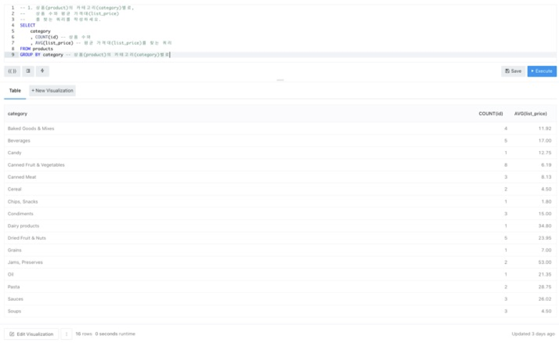

## 예시 답안

```sql
select 
    category
    , count(1) cnt
    , avg(list_price) avg_price
from products
group by category;
```

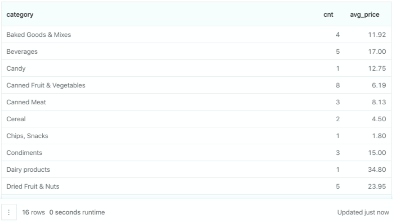

## 차이점

* count(id), count(1) 이외에는 없음.

# 2번 문제

2006년 1분기에 고객(customer)별 주문(order) 횟수, 주문한 상품(product)의 카테고리(category) 수,    
총 주문 금액(quantity * unit_price)을 찾는 쿼리를 작성하세요. (힌트: join)

## 내 답안

```sql
select
    c.id -- 고객(customer)별
    , count(o.id) as 'total ordered count' -- 주문(order) 횟수
    -- 총 주문 금액(quantity * unit_price) -- 주문 이력이 없는 customer는 0.00으로 처리
    , if (sum(od.quantity * od.unit_price) is null
        , 0.00
        , sum(od.quantity * od.unit_price)) as 'total order value'
    , count(distinct p.category) -- 주문한 상품(product)의 카테고리(category) 수
from customers c
left join orders o on o.customer_id = c.id
left join order_details od on od.order_id = o.id 
left join products p on p.id = od.product_id
group by c.id -- 고객(customer)별
```

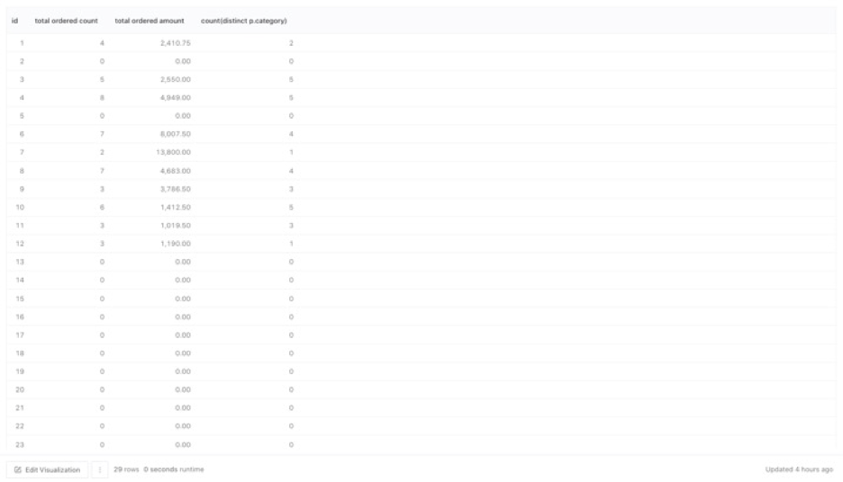

## 예시 답안

```sql
select 
    o.customer_id, 
    count(distinct o.id) order_cnt, 
    count(distinct p.category) category_cnt, 
    sum(od.quantity * od.unit_price) sum_of_order_price
from orders o
left join order_details od on o.id = od.order_id
left join products p on od.product_id = p.id
where '2006-01-01' <= o.order_date and o.order_date < '2006-04-01'
group by o.customer_id;
```

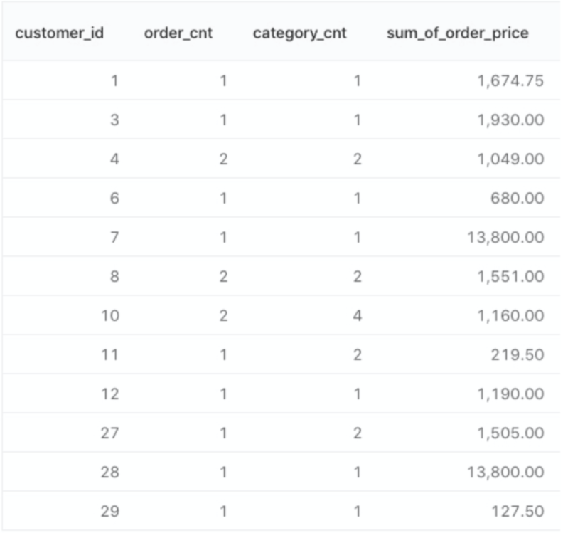

## 차이점

* 나의 경우 주문수량이 없는 고객의 데이터도 추출하기 위해 customers를 FROM절에 두었다.
  * 이 점은 멘토님도 이해하셨다. (쿼리에는 문제 없음)

## 틀린점

* count(o.id)가 아닌 count(distinct o.id)를 해야 했다. left join으로 인해 o.id에는 중복이 생긴다.
* '2006년 1분기에'라는 WHERE절을 빼먹었다.

# 3번 문제

2006년 3월에 주문(order)된 건의 주문 상태(status_name)를 찾는 쿼리를 작성하세요.   
(join을 사용하지 않고 쿼리를 작성하세요.) (힌트: orders_status 사용, sub-query)

## 내 답안

```sql
-- sub query 사용시의 쿼리
select
    id 
    , order_date
    , (select status_name from orders_status where id = status_id) as 'status_name'
from orders 
where date_format(order_date, '%Y-%m') = '2006-03'

-- join 사용시의 쿼리
select 
    o.id
    , o.order_date
    , os.status_name -- 주문 상태(status_name)
from orders o 
left join orders_status os on os.id = o.status_id
where date_format(o.order_date, '%Y%m') = '200603' -- 2006년 3월에 주문(order)된 건의
```

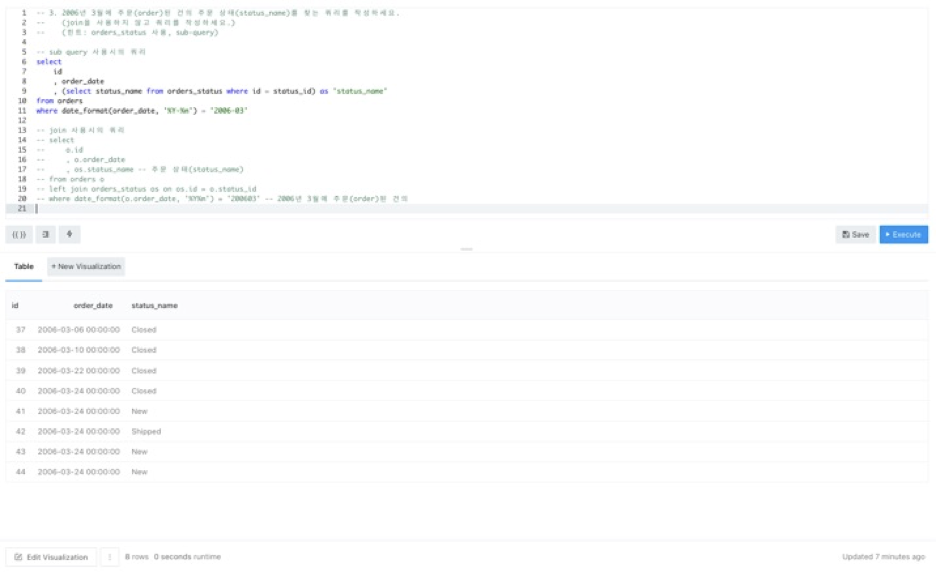

## 예시 답안

```sql
-- sub query 사용시의 쿼리
select 
    id
    , status_id
    , (select status_name from orders_status os where os.id = o.status_id) status_name
from orders o
where '2006-03-01' <= order_date and order_date < '2006-04-01';

-- join 사용시의 쿼리
select 
    o.id
    , o.status_id
    , os.status_name
from orders o
left join orders_status os on o.status_id = os.id
where '2006-03-01' <= o.order_date and o.order_date < '2006-04-01';
```

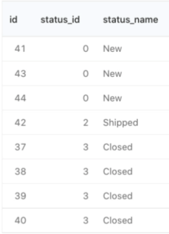

## 차이점

없음.

# 4번 문제

2006년 1분기 동안 세 번 이상 주문(order) 된 상품(product)과 그 상품의 주문 수를 찾는 쿼리를 작성하세요.    
(order_status는 신경쓰지 않으셔도 됩니다.) (힌트: sub-query or having)

## 내 답안

```sql
-- having을 사용
select 
    p.id -- 상품(product)과
    , count(od.id) -- 그 상품의 주문 수
from products p
left join order_details od on od.product_id = p.id
left join orders o on o.id = od.order_id 
where '2006-01' <= date_format(o.order_date, '%Y-%m') and 
                   date_format(o.order_date, '%Y-%m') <= '2006-03' -- 2006년 1분기 동안
group by p.id 
having count(od.id) >= 3 -- 세 번 이상 주문(order) 된
```

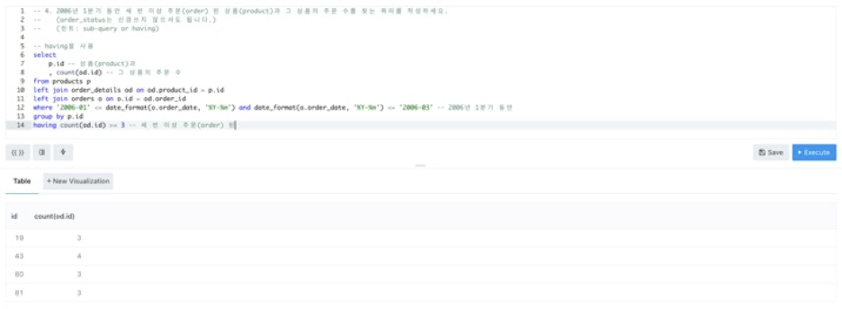

## 예시 답안

```sql
-- join 사용시의 쿼리
select 
    product_id
    , count(distinct o.id) cnt
from orders o
left join order_details od on o.id = od.order_id
where '2006-01-01' <= order_date and order_date < '2006-04-01'
group by product_id
having cnt >= 3;

-- sub query 사용시의 쿼리
select *
from (
    select product_id, count(distinct o.id) cnt
    from orders o
    left join order_details od on o.id = od.order_id
    where '2006-01-01' <= order_date and order_date < '2006-04-01'
    group by product_id
    ) a
where cnt >= 3
```

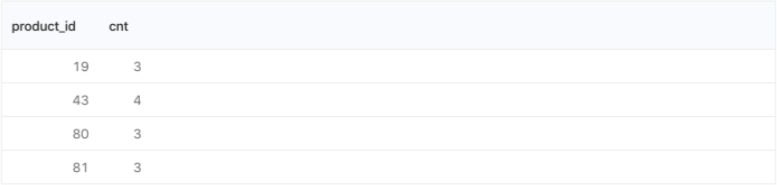

## 차이점

* 주문 횟수는 od.id가 아닌, o.id를 추출해야 했다. (order_details는 1건의 주문 안에 있는 하나의 상품 단위인 것 같다.)
* 2번 문제와 마찬가지로, count(o.id)가 아닌 count(distinct o.id)를 해야 했다. left join으로 인해 o.id에는 중복이 생긴다.
* products 테이블은 조인해도 그만 안해도 그만.

# 5-1번 문제

2006년 1분기, 2분기 연속으로 주문(order)을 받은 직원(employee)을 찾는 쿼리를 작성하세요.   
(order_status는 신경쓰지 않으셔도 됩니다.) (힌트: sub-query, inner join)

## 내 답안

```sql
select f.employee_id
from       (select distinct employee_id 
            from orders 
            where '2006-01' <= date_format(order_date, '%Y-%m') and 
                               date_format(order_date, '%Y-%m') <= '2006-03') f -- 1분기
inner join (select distinct employee_id 
            from orders 
            where '2006-04' <= date_format(order_date, '%Y-%m') and 
                               date_format(order_date, '%Y-%m') <= '2006-06') s -- 2분기
on f.employee_id = s.employee_id
```

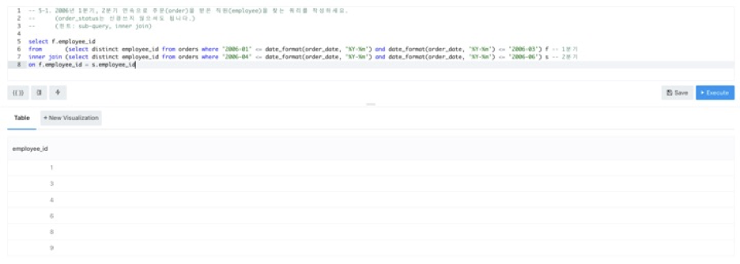

## 예시 답안

```sql
select o1.employee_id
from       (select distinct employee_id
            from orders
            where '2006-01-01' <= order_date and order_date < '2006-04-01') o1
inner join (select distinct employee_id
            from orders
            where '2006-04-01' <= order_date and order_date < '2006-07-01') o2
on o1.employee_id = o2.employee_id;
```

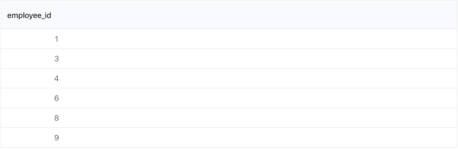

## 차이점

없음.

# 5-2번 문제

2006년 1분기, 2분기 연속으로 주문(order)을 받은 직원(employee)별로, 2006년 월별 주문 수를 찾는 쿼리를 작성하세요.  
(order_status는 신경쓰지 않으셔도 됩니다.) (힌트: sub-query 중첩, date_format() )

* 새로 배운 점: group 1, 2

## 내 답안

```sql
select 
    employee_id
    , date_format(order_date, '%Y-%m') as 'month'
    , count(*)
from orders
where 
    employee_id in (select distinct employee_id 
                    from orders 
                    where '2006-01' <= date_format(order_date, '%Y-%m') and 
                                       date_format(order_date, '%Y-%m') <= '2006-03') 
    and
    employee_id in (select distinct employee_id 
                    from orders 
                    where '2006-04' <= date_format(order_date, '%Y-%m') and 
                                       date_format(order_date, '%Y-%m') <= '2006-06')
group by employee_id, date_format(order_date, '%Y-%m')
```

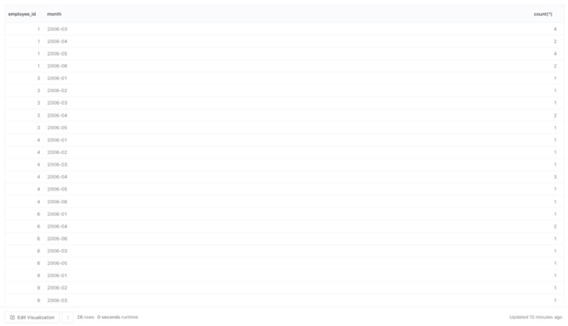

## 예시 답안

```sql
select 
    employee_id
    , date_format(order_date, '%Y-%m') ym
    , count(1) cnt
from orders
where employee_id in (
    select o1.employee_id
    from   (select distinct employee_id
            from orders
            where '2006-01-01' <= order_date and order_date < '2006-04-01') o1
inner join (select distinct employee_id
            from orders
            where '2006-04-01' <= order_date and order_date < '2006-07-01') o2
on o1.employee_id = o2.employee_id)
group by 1, 2;
```

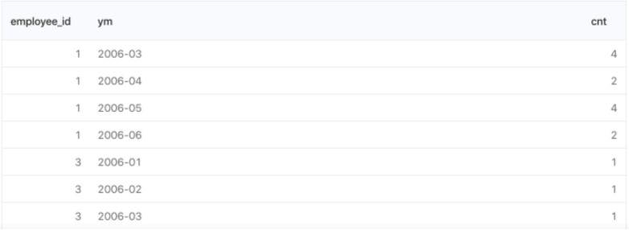

## 차이점

* 나는 count(*)을 쓰고 예시 답안에서는 count(1)을 썼다. 이 차이점은 1주차 과제에 설명되어 있다.

## 새로 알게 된 점

* GROUP BY 1, 2를 쓰면, SELECT 절의 1번째 취득 컬럼, 2번째 취득 컬럼을 참조하게 된다.   
  [What does SQL clause group by 1 mean](https://stackoverflow.com/questions/7392730/what-does-sql-clause-group-by-1-mean)
